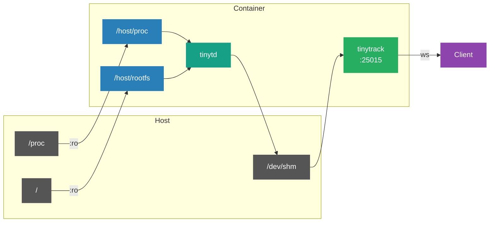

# Docker

## How It Works

TinyTrack в контейнере мониторит **хостовую** систему через bind-mount `/proc` и `/`:



## Quick Start

```bash
# docker compose (рекомендуется)
docker compose up -d
docker compose logs -f

# docker run
docker build -t tinytrack .
docker run -d \
  -v /proc:/host/proc:ro \
  -v /:/host/rootfs:ro   \
  -v /dev/shm:/dev/shm   \
  -p 25015:25015         \
  tinytrack
```

## Configuration via ENV

```bash
docker run -d \
  -v /proc:/host/proc:ro -v /:/host/rootfs:ro -v /dev/shm:/dev/shm \
  -p 25015:25015 \
  -e TT_INTERVAL_MS=500 \
  -e TT_L1_CAPACITY=7200 \
  -e TT_LOG_LEVEL=debug \
  tinytrack
```

Full list of variables: [configuration.md](configuration.md)

## Configuration via File

```bash
docker run -d \
  -v /proc:/host/proc:ro -v /:/host/rootfs:ro -v /dev/shm:/dev/shm \
  -v /path/to/my.conf:/etc/tinytrack/tinytrack.conf:ro \
  -p 25015:25015 \
  tinytrack
```

> [!NOTE]
> ENV переменные патчат конфиг даже если он смонтирован — ENV всегда имеет приоритет.

## TLS

```bash
openssl req -x509 -newkey rsa:4096 -keyout server.key -out server.crt \
    -days 365 -nodes -subj '/CN=localhost'

docker run -d \
  -v /proc:/host/proc:ro -v /:/host/rootfs:ro -v /dev/shm:/dev/shm \
  -v $(pwd)/certs:/certs:ro \
  -p 25015:25015 \
  -e TT_LISTEN=wss://0.0.0.0:25015 \
  -e TT_TLS_CERT=/certs/server.crt \
  -e TT_TLS_KEY=/certs/server.key \
  tinytrack
```

## tiny-cli внутри контейнера

```bash
docker exec -it <container> tiny-cli status
docker exec -it <container> tiny-cli metrics
docker exec -it <container> tiny-cli history l1
docker exec -it <container> tiny-cli dashboard

docker compose exec tinytrack tiny-cli dashboard
```

## Limitations

| Параметр | Поведение |
|----------|-----------|
| `hostname` | Container UTS namespace (not host) |
| `os_type` | Host kernel из `/host/proc/sys/kernel/ostype` ✓ |
| `uptime` | Host uptime из `/host/proc/uptime` ✓ |
| CPU/RAM/Net | Host data через `/host/proc` ✓ |
| Disk | `statvfs(/host/rootfs)` — host disk ✓ |

> [!WARNING]
> Не монтируйте `/` хоста с правами записи. Используйте `:ro` флаг.
