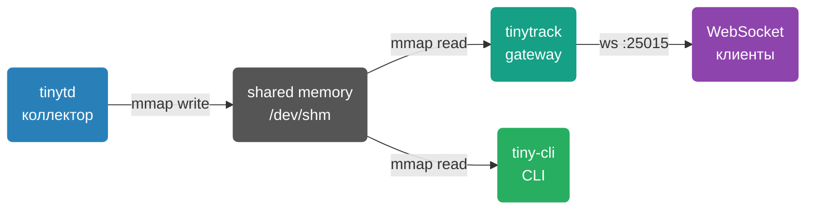
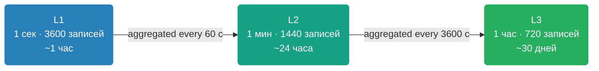

# TinyTrack Overview

TinyTrack — минималистичный демон сбора системных метрик для Linux с real-time стримингом через WebSocket. Не требует зависимостей в рантайме кроме libc и libssl.

## Why TinyTrack

> [!NOTE]
> TinyTrack разработан для ресурсоограниченных окружений: VDS с 1 GB RAM и 1 CPU. Потребление — менее 1% CPU и менее 10 MB RAM.

Типичные сценарии использования:

- Host or container monitoring without client-side agents
- Real-time dashboard in browser or terminal
- Three-tier metrics history
- Host system monitoring from a Docker container

## Components

| Компонент | Бинарник | Назначение |
|-----------|----------|------------|
| **tinytd** | `tinytd` | Демон сбора метрик (CPU, RAM, сеть, диск) |
| **tinytrack** | `tinytrack` | WebSocket/HTTP gateway |
| **tiny-cli** | `tiny-cli` | CLI клиент с ncurses дашбордом |

## Metrics Collected

| Метрика | Источник | Описание |
|---------|----------|----------|
| CPU | `/proc/stat` | Total across all cores, % |
| Memory | `/proc/meminfo` | (total − available) / total, % |
| Network RX/TX | `/proc/net/dev` | All interfaces except lo, bytes/s |
| Disk | `statvfs(rootfs_path)` | Root filesystem usage, % |
| Load average | `/proc/loadavg` | 1 / 5 / 15 минут |

## Ring Buffer

Buffer lives in `/dev/shm` (tmpfs) — zero-copy mmap access. Periodically synced to a shadow file on disk for recovery after restart.

## Endpoints

| Протокол | Адрес | Описание |
|----------|-------|----------|
| WebSocket | `ws://host:25015/websocket` | Binary protocol v1/v2 |
| WebSocket TLS | `wss://host:25015/websocket` | Encrypted connection |
| HTTP | `GET http://host:25015/api/metrics/live` | JSON metrics snapshot |
