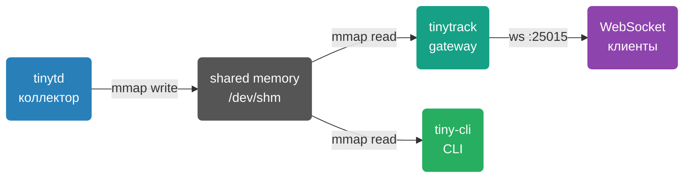

# TinyTrack Overview

TinyTrack — минималистичный демон сбора системных метрик для Linux с real-time стримингом через WebSocket. Не требует зависимостей в рантайме кроме libc и libssl.

## Why TinyTrack

> [!NOTE]
> TinyTrack разработан для ресурсоограниченных окружений: VDS с 1 GB RAM и 1 CPU. Потребление — менее 1% CPU и менее 10 MB RAM.

Типичные сценарии использования:

- Host or container monitoring without client-side agents
- Real-time dashboard in browser or terminal
- Three-tier metrics history
- Host system monitoring from a Docker container

## Components



| Компонент | Бинарник | Назначение |
|-----------|----------|------------|
| **tinytd** | `tinytd` | Демон сбора метрик (CPU, RAM, сеть, диск) |
| **tinytrack** | `tinytrack` | WebSocket/HTTP gateway |
| **tiny-cli** | `tiny-cli` | CLI клиент с ncurses дашбордом |

## Metrics Collected

| Метрика | Источник | Описание |
|---------|----------|----------|
| CPU | `/proc/stat` | Total across all cores, % |
| Memory | `/proc/meminfo` | (total − available) / total, % |
| Network RX/TX | `/proc/net/dev` | All interfaces except lo, bytes/s |
| Disk | `statvfs(rootfs_path)` | Root filesystem usage, % |
| Load average | `/proc/loadavg` | 1 / 5 / 15 минут |

## Ring Buffer


Buffer lives in `/dev/shm` (tmpfs) — zero-copy mmap access. Periodically synced to a shadow file on disk for recovery after restart.

## Endpoints

| Protocol | URL | Auth | Description |
|----------|-----|------|-------------|
| WebSocket | `ws://host:25015/v1/stream` | Bearer / CMD_AUTH | Binary protocol v1/v2, real-time streaming |
| WebSocket | `ws://host:25015/websocket` | Bearer / CMD_AUTH | Legacy alias (kept for compatibility) |
| HTTP GET | `http://host:25015/v1/metrics` | Bearer | Current metrics snapshot |
| HTTP GET | `http://host:25015/v1/sysinfo` | Bearer | System info (hostname, OS, uptime, ring config) |
| HTTP GET | `http://host:25015/v1/status` | — | Health check (public, no auth) |
| HTTP POST | `http://host:25015/v1/stream/pause` | Bearer | Pause metrics push to all WS clients |
| HTTP POST | `http://host:25015/v1/stream/resume` | Bearer | Resume metrics push |

### Content negotiation

All `GET /v1/*` endpoints support multiple response formats via:
- `Accept` header (standard HTTP)
- `?format=` query parameter (fallback)

| Format | Accept header | ?format= | Content-Type |
|--------|--------------|----------|--------------|
| JSON (default) | `application/json` | `json` | `application/json` |
| CSV | `text/csv` | `csv` | `text/csv` |
| XML | `application/xml` | `xml` | `application/xml` |
| Prometheus/OpenMetrics | `text/plain` | `prometheus` | `text/plain; version=0.0.4` |

**Examples:**
```bash
# JSON (default)
curl http://host:25015/v1/metrics

# CSV
curl http://host:25015/v1/metrics?format=csv

# Prometheus
curl -H "Accept: text/plain" http://host:25015/v1/metrics

# With auth
curl -H "Authorization: Bearer mytoken" http://host:25015/v1/metrics
```

### API versioning

`/v1/` is the HTTP REST API version, independent of the binary WebSocket protocol version (`TT_PROTO_V1`, `TT_PROTO_V2`).

A new `/v2/` will be introduced only on breaking changes (field rename, type change, endpoint removal). Both versions run simultaneously — old clients are not broken. Deprecated versions announce via `Deprecation: true` and `Sunset:` response headers.

### Prometheus / Grafana

```bash
# Prometheus scrape
curl http://host:25015/v1/metrics?format=prometheus
```

**Prometheus `scrape_config`:**
```yaml
scrape_configs:
  - job_name: tinytrack
    static_configs:
      - targets: ['host:25015']
    metrics_path: /v1/metrics
    params:
      format: [prometheus]
```

**Available metrics:**

| Metric | Type | Description |
|--------|------|-------------|
| `tinytrack_cpu_usage_ratio` | gauge | CPU usage 0..1 |
| `tinytrack_memory_usage_ratio` | gauge | Memory usage 0..1 |
| `tinytrack_disk_usage_ratio` | gauge | Disk usage 0..1 |
| `tinytrack_disk_total_bytes` | gauge | Total disk space |
| `tinytrack_disk_free_bytes` | gauge | Free disk space |
| `tinytrack_load_average{interval="1m\|5m\|15m"}` | gauge | Load average |
| `tinytrack_processes_running` | gauge | Running processes |
| `tinytrack_processes_total` | gauge | Total processes |
| `tinytrack_network_receive_bytes_total` | counter | Network RX bytes/s |
| `tinytrack_network_transmit_bytes_total` | counter | Network TX bytes/s |
| `tinytrack_scrape_timestamp_ms` | gauge | Timestamp of last sample |
