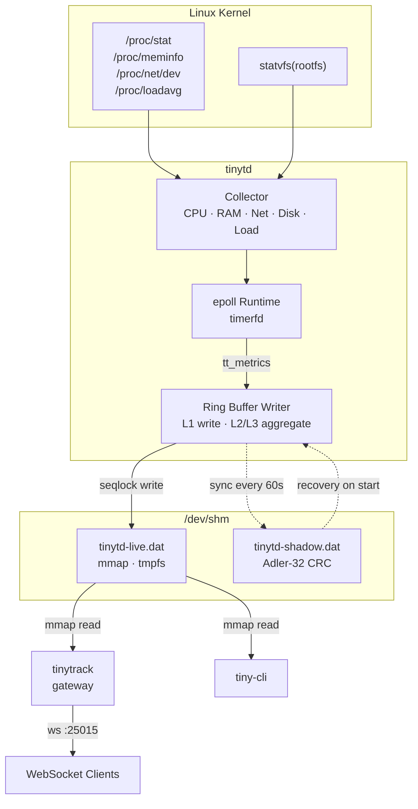
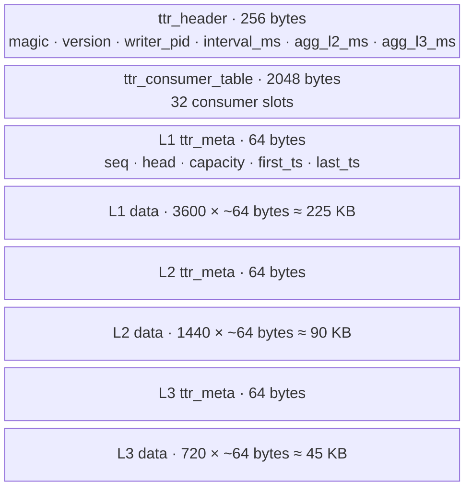
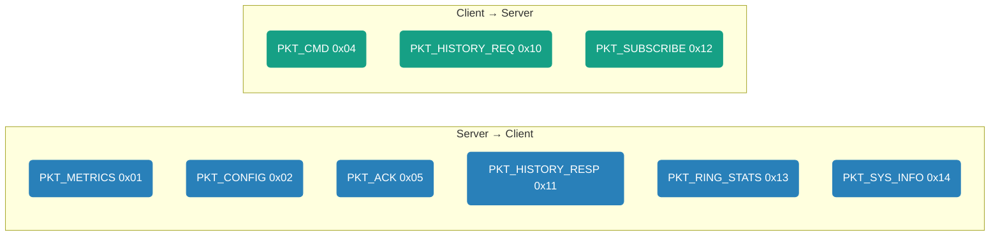
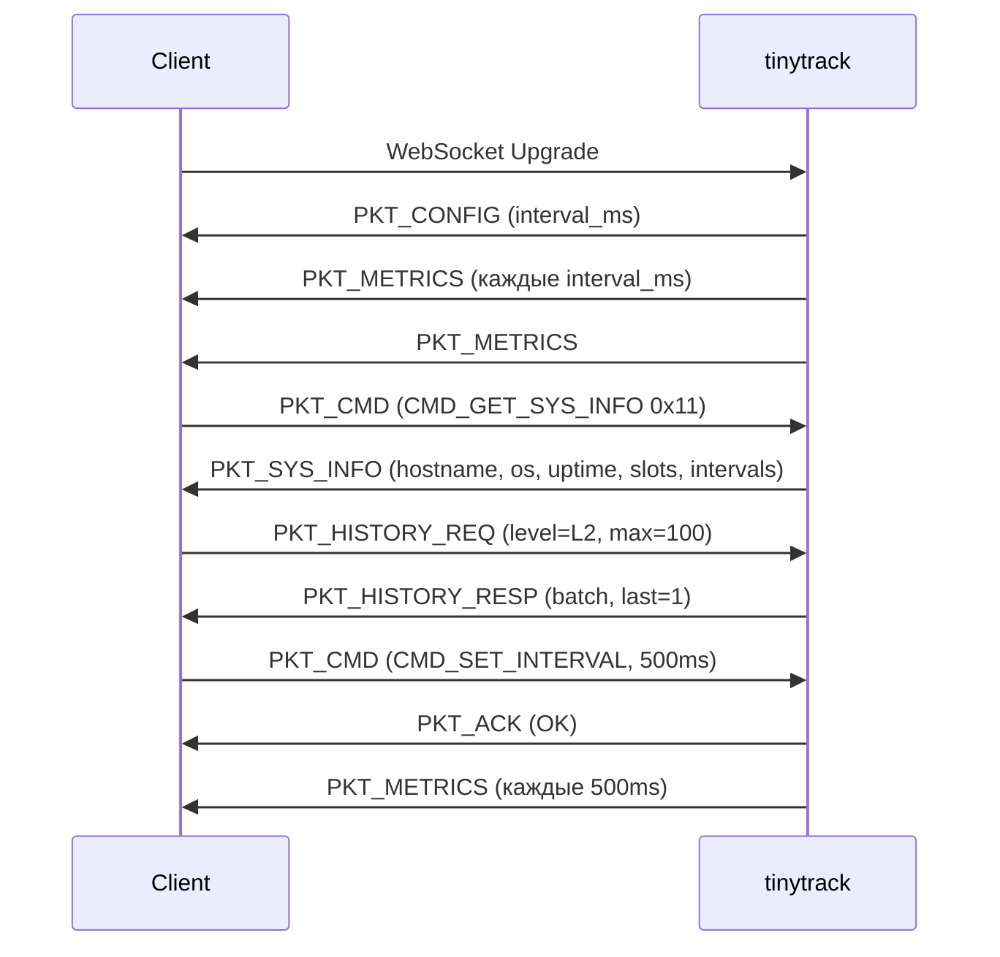
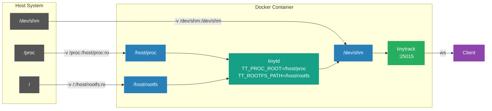

# Архитектура TinyTrack

## Общая схема



## Shared Memory Layout



Итого: ~360 KB при дефолтных настройках.

**Seqlock** защищает каждый уровень от гонок между writer и readers без мьютексов.

## Протокол

Бинарный протокол поверх WebSocket. Каждый фрейм начинается с 10-байтового заголовка:

```
+--------+--------+--------+-----------+-----------+----------+
| magic  | ver    | type   | length    | timestamp | checksum |
| 1 byte | 1 byte | 1 byte | 2 bytes   | 4 bytes   | 1 byte   |
+--------+--------+--------+-----------+-----------+----------+
|                    payload (0..N bytes)                      |
+--------------------------------------------------------------+
```

- `magic` = `0xAA`
- `checksum` = XOR всех байт заголовка кроме самого checksum

### Типы пакетов



### Сессия



## Docker — мониторинг хоста



> [!NOTE]
> `os_type` и `uptime` читаются из `/host/proc/sys/kernel/ostype` и `/host/proc/uptime` — отражают хостовую систему. `hostname` отражает UTS namespace контейнера — это ограничение ядра Linux.
