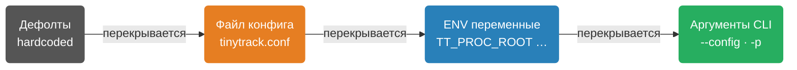

# Конфигурация TinyTrack

## Приоритет параметров



> [!IMPORTANT]
> В Docker: entrypoint генерирует конфиг из дефолтов, затем патчит его значениями из ENV. Если смонтирован пользовательский конфиг — ENV всё равно его патчит.

## Файлы конфигурации

| Файл | Назначение |
|------|-----------|
| `etc/tinytrack.conf` | Продакшн (хост) |
| `etc/tinytrack.conf-docker` | Docker / контейнер |
| `etc/tinytrack.conf-debug` | Локальная отладка |
| `tests/tinytrack.conf-test` | Автотесты |

## Секция `[tinytd]`

| Параметр | По умолчанию | Описание |
|----------|--------------|----------|
| `user` | `tinytd` | Пользователь после сброса привилегий |
| `group` | `tinytd` | Группа |
| `pid_file` | `/var/run/tinytd.pid` | Путь к PID-файлу |
| `log_backend` | `auto` | Backend логирования |
| `log_level` | `info` | Минимальный уровень |

**log_backend:** `auto` · `stderr` · `stdout` · `docker` · `syslog` · `journal`

> [!TIP]
> Используйте `docker` backend в контейнерах — он пишет в stdout без timestamp. Docker добавляет timestamp сам через `--log-opt`.

## Секция `[collection]`

| Параметр | ENV | По умолчанию | Описание |
|----------|-----|--------------|----------|
| `interval_ms` | `TT_INTERVAL_MS` | `1000` | Интервал сбора, мс |
| `du_interval_sec` | `TT_DU_INTERVAL_SEC` | `30` | Интервал disk usage, с |
| `proc_root` | `TT_PROC_ROOT` | `/proc` | Путь к `/proc` |
| `rootfs_path` | `TT_ROOTFS_PATH` | `/` | Путь к корневой ФС |

## Секция `[storage]`

| Параметр | ENV | По умолчанию | Описание |
|----------|-----|--------------|----------|
| `live_path` | `TT_LIVE_PATH` | `/dev/shm/tinytd-live.dat` | Live ring buffer |
| `shadow_path` | `TT_SHADOW_PATH` | `/var/lib/tinytrack/tinytd-shadow.dat` | Персистентная копия |
| `shadow_sync_interval_sec` | — | `60` | Интервал синхронизации, с |
| `file_mode` | — | `416` (0640) | Права доступа (decimal) |

> [!WARNING]
> `live_path` должен быть на tmpfs (`/dev/shm`). В Docker используйте отдельное имя файла (`tinytd-docker-live.dat`) чтобы не конфликтовать с хостовым демоном при shared `/dev/shm`.

## Секция `[ringbuffer]`

| Параметр | ENV | По умолчанию | Описание |
|----------|-----|--------------|----------|
| `l1_capacity` | `TT_L1_CAPACITY` | `3600` | Ёмкость L1 |
| `l2_capacity` | `TT_L2_CAPACITY` | `1440` | Ёмкость L2 |
| `l3_capacity` | `TT_L3_CAPACITY` | `720` | Ёмкость L3 |
| `l2_agg_interval_sec` | `TT_L2_AGG_INTERVAL` | `60` | Агрегация L1→L2, с |
| `l3_agg_interval_sec` | `TT_L3_AGG_INTERVAL` | `3600` | Агрегация L2→L3, с |

## Секция `[gateway]`

| Параметр | ENV | По умолчанию | Описание |
|----------|-----|--------------|----------|
| `listen` | `TT_LISTEN` | `ws://0.0.0.0:25015` | Адрес и порт |
| `update_interval` | `TT_UPDATE_INTERVAL` | `1000` | Интервал пуша, мс |
| `log_backend` | `TT_LOG_BACKEND` | `auto` | Backend логирования |
| `log_level` | `TT_LOG_LEVEL` | `info` | Уровень логов |
| `tls_cert` | `TT_TLS_CERT` | — | PEM-сертификат |
| `tls_key` | `TT_TLS_KEY` | — | PEM-ключ |
| `tls_ca` | `TT_TLS_CA` | — | CA-бандл (опционально) |

## TLS

```ini
[gateway]
listen   = wss://0.0.0.0:25015
tls_cert = /etc/tinytrack/server.crt
tls_key  = /etc/tinytrack/server.key
```

Генерация self-signed сертификата:

```bash
openssl req -x509 -newkey rsa:4096 -keyout server.key -out server.crt \
    -days 365 -nodes -subj '/CN=localhost'
```
