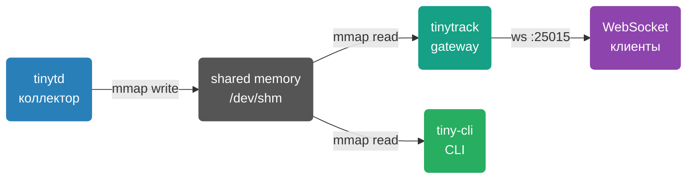

# Обзор TinyTrack

TinyTrack — минималистичный демон сбора системных метрик для Linux с real-time стримингом через WebSocket. Не требует зависимостей в рантайме кроме libc и libssl.

## Зачем

> [!NOTE]
> TinyTrack разработан для ресурсоограниченных окружений: VDS с 1 GB RAM и 1 CPU. Потребление — менее 1% CPU и менее 10 MB RAM.

Типичные сценарии использования:

- Мониторинг хоста или контейнера без агентов на стороне клиента
- Real-time дашборд в браузере или терминале
- История метрик трёх уровней детализации
- Мониторинг хостовой системы из Docker-контейнера

## Компоненты



| Компонент | Бинарник | Назначение |
|-----------|----------|------------|
| **tinytd** | `tinytd` | Демон сбора метрик (CPU, RAM, сеть, диск) |
| **tinytrack** | `tinytrack` | WebSocket/HTTP gateway |
| **tiny-cli** | `tiny-cli` | CLI клиент с ncurses дашбордом |

## Что собирается

| Метрика | Источник | Описание |
|---------|----------|----------|
| CPU | `/proc/stat` | Суммарная загрузка всех ядер, % |
| Memory | `/proc/meminfo` | (total − available) / total, % |
| Network RX/TX | `/proc/net/dev` | Все интерфейсы кроме lo, байт/с |
| Disk | `statvfs(rootfs_path)` | Использование корневой ФС, % |
| Load average | `/proc/loadavg` | 1 / 5 / 15 минут |

## Кольцевой буфер


Буфер хранится в `/dev/shm` (tmpfs) — zero-copy доступ через mmap. Периодически синхронизируется в shadow-файл на диске для восстановления после перезапуска.

## Эндпоинты

| Протокол | URL | Auth | Описание |
|----------|-----|------|----------|
| WebSocket | `ws://host:25015/v1/stream` | Bearer / CMD_AUTH | Бинарный протокол v1/v2, real-time стриминг |
| WebSocket | `ws://host:25015/websocket` | Bearer / CMD_AUTH | Legacy-алиас (для совместимости) |
| HTTP GET | `http://host:25015/v1/metrics` | Bearer | Снимок текущих метрик |
| HTTP GET | `http://host:25015/v1/sysinfo` | Bearer | Системная информация (hostname, OS, uptime, конфиг буферов) |
| HTTP GET | `http://host:25015/v1/status` | — | Health check (публичный, без авторизации) |
| HTTP POST | `http://host:25015/v1/stream/pause` | Bearer | Приостановить пуш метрик всем WS-клиентам |
| HTTP POST | `http://host:25015/v1/stream/resume` | Bearer | Возобновить пуш метрик |

### Content negotiation

Все `GET /v1/*` эндпоинты поддерживают несколько форматов ответа:
- заголовок `Accept` (стандарт HTTP)
- параметр `?format=` (fallback)

| Формат | Accept | ?format= | Content-Type |
|--------|--------|----------|--------------|
| JSON (по умолчанию) | `application/json` | `json` | `application/json` |
| CSV | `text/csv` | `csv` | `text/csv` |
| XML | `application/xml` | `xml` | `application/xml` |
| Prometheus/OpenMetrics | `text/plain` | `prometheus` | `text/plain; version=0.0.4` |

**Примеры:**
```bash
# JSON (по умолчанию)
curl http://host:25015/v1/metrics

# CSV
curl http://host:25015/v1/metrics?format=csv

# Prometheus
curl -H "Accept: text/plain" http://host:25015/v1/metrics

# С авторизацией
curl -H "Authorization: Bearer mytoken" http://host:25015/v1/metrics
```

### Версионирование API

`/v1/` — версия HTTP REST API, независимая от версии бинарного WS-протокола (`TT_PROTO_V1`, `TT_PROTO_V2`).

`/v2/` появится только при breaking changes (переименование поля, изменение типа, удаление эндпоинта). Обе версии работают одновременно — старые клиенты не ломаются. Устаревшие версии анонсируются через заголовки `Deprecation: true` и `Sunset:`.

### Prometheus / Grafana

```bash
# Prometheus scrape
curl http://host:25015/v1/metrics?format=prometheus
```

**Prometheus `scrape_config`:**
```yaml
scrape_configs:
  - job_name: tinytrack
    static_configs:
      - targets: ['host:25015']
    metrics_path: /v1/metrics
    params:
      format: [prometheus]
```

**Grafana — Infinity datasource (без Prometheus):**

Установите [плагин Infinity](https://grafana.com/grafana/plugins/yesoreyeram-infinity-datasource/), добавьте datasource типа `Infinity`:
- URL: `http://host:25015/v1/metrics?format=prometheus`
- Parser: `Backend` → `Prometheus`

**Доступные метрики:**

| Метрика | Тип | Описание |
|---------|-----|----------|
| `tinytrack_cpu_usage_ratio` | gauge | Загрузка CPU 0..1 |
| `tinytrack_memory_usage_ratio` | gauge | Использование памяти 0..1 |
| `tinytrack_disk_usage_ratio` | gauge | Использование диска 0..1 |
| `tinytrack_disk_total_bytes` | gauge | Общий объём диска |
| `tinytrack_disk_free_bytes` | gauge | Свободное место |
| `tinytrack_load_average{interval="1m\|5m\|15m"}` | gauge | Средняя нагрузка |
| `tinytrack_processes_running` | gauge | Запущенные процессы |
| `tinytrack_processes_total` | gauge | Всего процессов |
| `tinytrack_network_receive_bytes_total` | counter | Входящий трафик байт/с |
| `tinytrack_network_transmit_bytes_total` | counter | Исходящий трафик байт/с |
| `tinytrack_scrape_timestamp_ms` | gauge | Timestamp последнего сэмпла |
