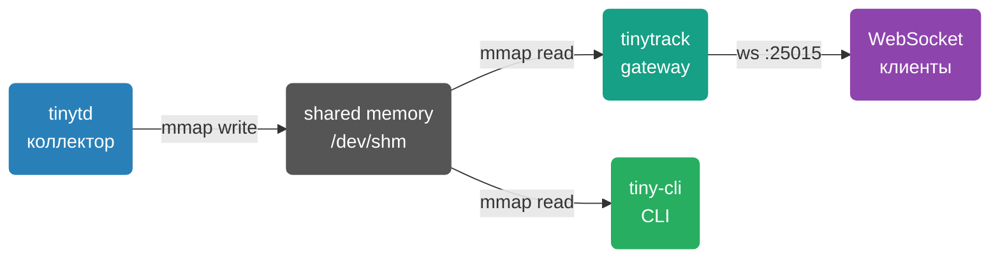
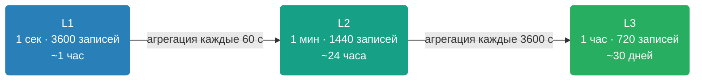

# Обзор TinyTrack

TinyTrack — минималистичный демон сбора системных метрик для Linux с real-time стримингом через WebSocket. Не требует зависимостей в рантайме кроме libc и libssl.

## Зачем

> [!NOTE]
> TinyTrack разработан для ресурсоограниченных окружений: VDS с 1 GB RAM и 1 CPU. Потребление — менее 1% CPU и менее 10 MB RAM.

Типичные сценарии использования:

- Мониторинг хоста или контейнера без агентов на стороне клиента
- Real-time дашборд в браузере или терминале
- История метрик трёх уровней детализации
- Мониторинг хостовой системы из Docker-контейнера

## Компоненты

| Компонент | Бинарник | Назначение |
|-----------|----------|------------|
| **tinytd** | `tinytd` | Демон сбора метрик (CPU, RAM, сеть, диск) |
| **tinytrack** | `tinytrack` | WebSocket/HTTP gateway |
| **tiny-cli** | `tiny-cli` | CLI клиент с ncurses дашбордом |

## Что собирается

| Метрика | Источник | Описание |
|---------|----------|----------|
| CPU | `/proc/stat` | Суммарная загрузка всех ядер, % |
| Memory | `/proc/meminfo` | (total − available) / total, % |
| Network RX/TX | `/proc/net/dev` | Все интерфейсы кроме lo, байт/с |
| Disk | `statvfs(rootfs_path)` | Использование корневой ФС, % |
| Load average | `/proc/loadavg` | 1 / 5 / 15 минут |

## Кольцевой буфер

Буфер хранится в `/dev/shm` (tmpfs) — zero-copy доступ через mmap. Периодически синхронизируется в shadow-файл на диске для восстановления после перезапуска.

## Эндпоинты

| Протокол | Адрес | Описание |
|----------|-------|----------|
| WebSocket | `ws://host:25015/websocket` | Бинарный протокол v1/v2 |
| WebSocket TLS | `wss://host:25015/websocket` | Зашифрованное соединение |
| HTTP | `GET http://host:25015/api/metrics/live` | JSON-снимок метрик |
