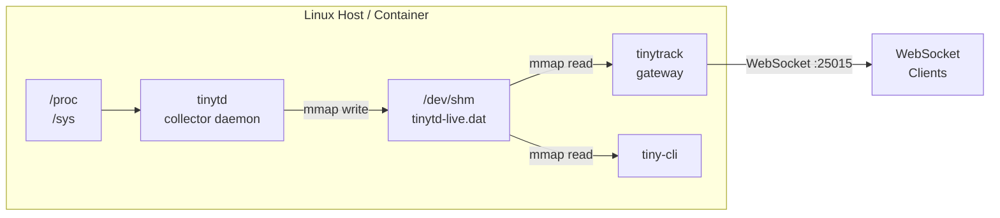

<div align="center">

```
████████╗██╗███╗   ██╗██╗   ██╗████████╗██████╗  █████╗  ██████╗██╗  ██╗
╚══██╔══╝██║████╗  ██║╚██╗ ██╔╝╚══██╔══╝██╔══██╗██╔══██╗██╔════╝██║ ██╔╝
   ██║   ██║██╔██╗ ██║ ╚████╔╝    ██║   ██████╔╝███████║██║     █████╔╝
   ██║   ██║██║╚██╗██║  ╚██╔╝     ██║   ██╔══██╗██╔══██║██║     ██╔═██╗
   ██║   ██║██║ ╚████║   ██║      ██║   ██║  ██║██║  ██║╚██████╗██║  ██╗
   ╚═╝   ╚═╝╚═╝  ╚═══╝   ╚═╝      ╚═╝   ╚═╝  ╚═╝╚═╝  ╚═╝ ╚═════╝╚═╝  ╚═╝
```

**Lightweight Linux system metrics daemon with WebSocket streaming**


</div>

---

TinyTrack — минималистичный демон сбора системных метрик для Linux с real-time стримингом через WebSocket. Не требует зависимостей в рантайме кроме libc и libssl.

## Содержание

- [Быстрый старт](#быстрый-старт)
- [Документация](#документация)
- [Архитектура](#архитектура)
- [Компоненты](#компоненты)

---

## Быстрый старт

### На хосте

```bash
./bootstrap.sh && ./configure && make
sudo make install
sudo systemctl start tinytd tinytrack
```

### В Docker

```bash
docker compose up -d
```

Gateway доступен на `ws://localhost:25015/websocket`.

### tiny-cli

```bash
# Статус и информация о буфере
docker compose exec tinytrack tiny-cli status

# Live метрики
docker compose exec tinytrack tiny-cli metrics

# История: l1=1ч, l2=24ч, l3=7д
docker compose exec tinytrack tiny-cli history l1

# Интерактивный дашборд
docker compose exec tinytrack tiny-cli dashboard
```

---

## Документация

| Документ | Описание |
|----------|----------|
| [docs/OVERVIEW.md](docs/OVERVIEW.md) | Что такое TinyTrack, зачем и как использовать |
| [docs/INSTALL.md](docs/INSTALL.md) | Установка на хост (systemd, пользователи, права) |
| [docs/DOCKER.md](docs/DOCKER.md) | Запуск в Docker: конфиг, ENV, TLS, примеры |
| [docs/CONFIGURATION.md](docs/CONFIGURATION.md) | Все параметры, приоритеты, ENV переменные |
| [docs/ARCHITECTURE.md](docs/ARCHITECTURE.md) | Архитектура, диаграммы, протокол |
| [docs/TROUBLESHOOTING.md](docs/TROUBLESHOOTING.md) | Ошибки, отладка, диагностика |
| [docs/BUILD.md](docs/BUILD.md) | Сборка из исходников |
| [docs/TESTING.md](docs/TESTING.md) | Тестирование |
| [docs/HACKING.md](docs/HACKING.md) | Разработка и контрибьютинг |

---

## Архитектура



---

## Компоненты

| Компонент | Бинарник | Назначение |
|-----------|----------|------------|
| **tinytd** | `tinytd` | Демон сбора метрик (CPU, RAM, сеть, диск) |
| **tinytrack** | `tinytrack` | WebSocket/HTTP gateway |
| **tiny-cli** | `tiny-cli` | CLI клиент с ncurses дашбордом |
