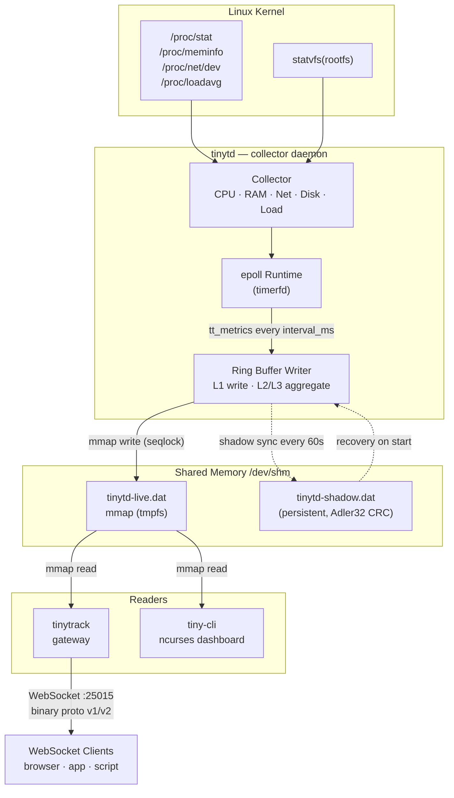
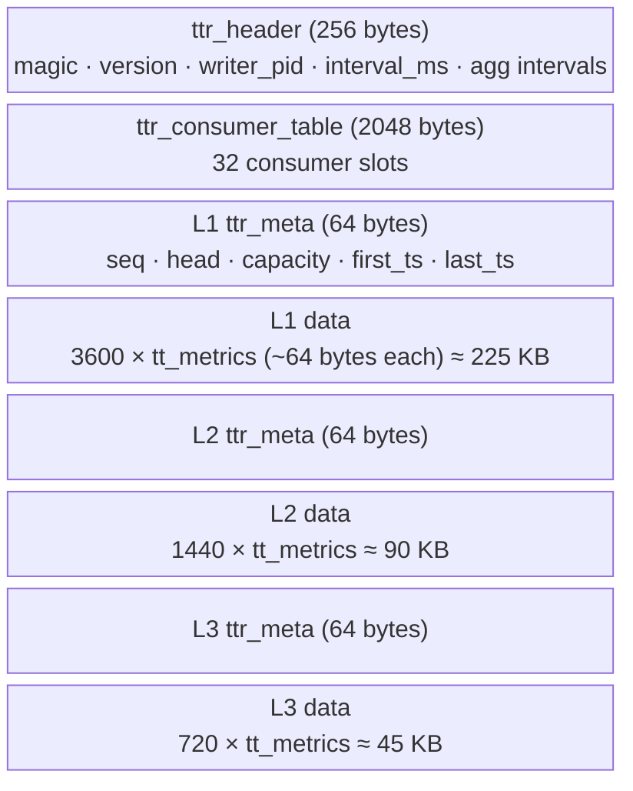
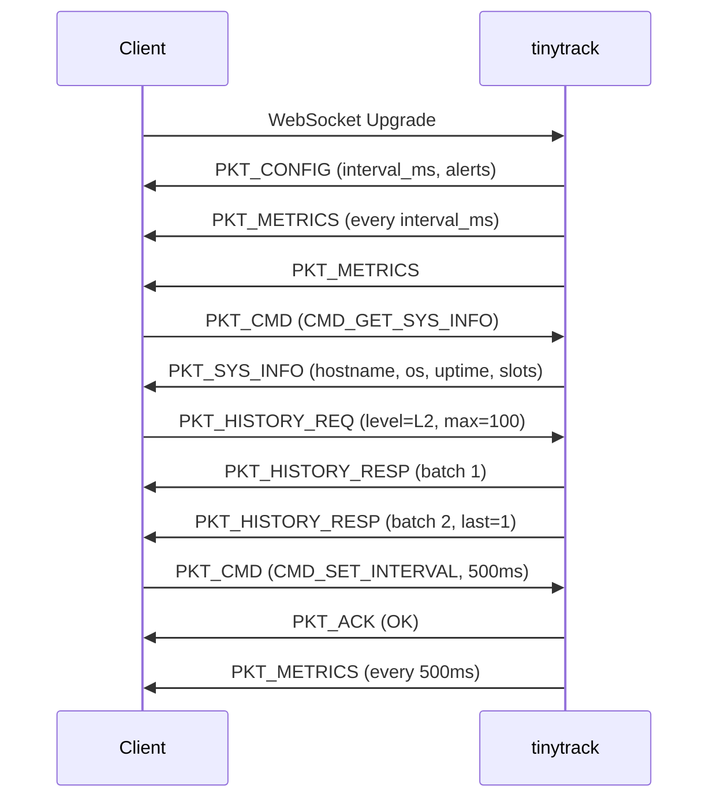
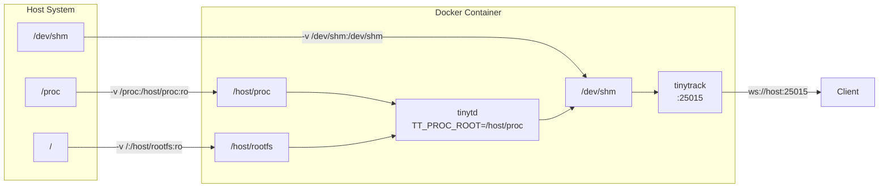

# Архитектура TinyTrack

## Общая схема



## Компоненты

### tinytd

Демон сбора метрик. Работает как системный сервис (systemd) или в foreground (`--no-daemon`).

**Жизненный цикл:**
1. Читает конфиг → инициализирует sysfs пути
2. Создаёт/восстанавливает live-файл в `/dev/shm`
3. Сбрасывает привилегии до `tinytd:tinytd`
4. Запускает epoll-цикл с `timerfd` на `interval_ms`
5. Каждый тик: читает `/proc/*` → пишет `tt_metrics` в L1 → агрегирует в L2/L3

### tinytrack

WebSocket/HTTP gateway. Читает live-файл через mmap и стримит метрики клиентам.

**Особенности:**
- Один epoll на все соединения (edge-triggered)
- Поддержка TLS через OpenSSL
- HTTP endpoint `/api/metrics/live` для REST-клиентов
- Бинарный протокол v1/v2 (см. [протокол](#протокол))

### tiny-cli

CLI-клиент. Читает live-файл напрямую через mmap (без сети).

```
tiny-cli status      — статус демона и буфера
tiny-cli metrics     — live метрики (обновление каждую секунду)
tiny-cli history l1  — история L1 (последний час)
tiny-cli dashboard   — интерактивный ncurses дашборд
```

## Shared Memory Layout



Итого: ~360 KB на дефолтных настройках.

**Seqlock** защищает каждый уровень от гонок между writer и readers без мьютексов.

## Протокол

Бинарный протокол поверх WebSocket. Каждый фрейм начинается с 10-байтового заголовка:

```
+--------+--------+--------+-----------+-----------+----------+
| magic  | ver    | type   | length    | timestamp | checksum |
| 1 byte | 1 byte | 1 byte | 2 bytes   | 4 bytes   | 1 byte   |
+--------+--------+--------+-----------+-----------+----------+
|                    payload (0..N bytes)                      |
+--------------------------------------------------------------+
```

### Типы пакетов

| Тип | Код | Направление | Описание |
|-----|-----|-------------|----------|
| `PKT_METRICS` | `0x01` | server→client | Снимок метрик |
| `PKT_CONFIG` | `0x02` | server→client | Конфигурация демона |
| `PKT_CMD` | `0x04` | client→server | Команда |
| `PKT_ACK` | `0x05` | server→client | Подтверждение команды |
| `PKT_HISTORY_REQ` | `0x10` | client→server | Запрос истории |
| `PKT_HISTORY_RESP` | `0x11` | server→client | Ответ с историей |
| `PKT_SUBSCRIBE` | `0x12` | client→server | Подписка на уровень |
| `PKT_RING_STATS` | `0x13` | server→client | Статистика буфера |
| `PKT_SYS_INFO` | `0x14` | server→client | Системная информация |

### Сессия



## Docker — мониторинг хоста



`tinytd` читает метрики хоста через bind-mounted `/proc`. `os_type` и `uptime` берутся из `/host/proc/sys/kernel/ostype` и `/host/proc/uptime` — отражают хостовую систему.

> **Примечание:** `hostname` в Docker отражает UTS namespace контейнера, а не хоста — это ограничение ядра Linux.
