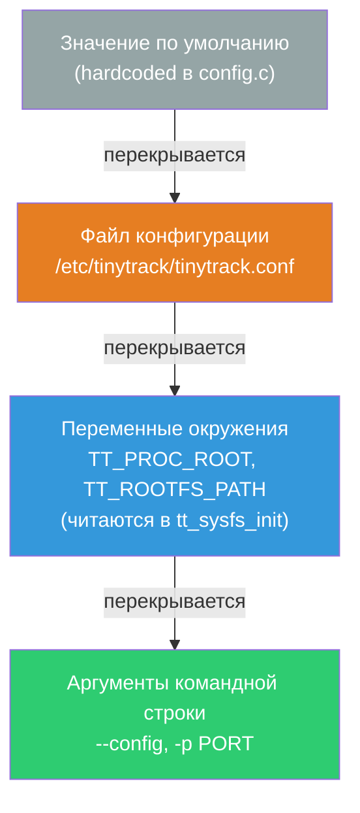

# Конфигурация TinyTrack

## Приоритет параметров



**Наивысший приоритет** — аргументы CLI. Затем ENV, затем конфиг-файл, затем дефолты.

> В Docker: entrypoint генерирует конфиг из дефолтов, затем патчит его значениями из ENV. Если смонтирован пользовательский конфиг — ENV всё равно его патчит.

---

## Файлы конфигурации

| Файл | Назначение |
|------|-----------|
| `/etc/tinytrack/tinytrack.conf` | Продакшн (хост) |
| `etc/tinytrack.conf-docker` | Docker / контейнер |
| `etc/tinytrack.conf-debug` | Локальная отладка |
| `tests/tinytrack.conf-test` | Автотесты |

---

## Секция `[tinytd]`

| Параметр | Тип | По умолчанию | Описание |
|----------|-----|--------------|----------|
| `user` | string | `tinytd` | Пользователь после сброса привилегий |
| `group` | string | `tinytd` | Группа после сброса привилегий |
| `pid_file` | path | `/var/run/tinytd.pid` | Путь к PID-файлу |
| `log_backend` | enum | `auto` | Backend логирования (см. ниже) |
| `log_level` | enum | `info` | Минимальный уровень логов |

### log_backend

| Значение | Описание |
|----------|----------|
| `auto` | Автовыбор: journal → syslog → stderr |
| `stderr` | Стандартный поток ошибок (с timestamp) |
| `stdout` | Стандартный вывод (с timestamp) |
| `docker` | stdout без timestamp — Docker добавляет его сам |
| `syslog` | Традиционный syslog |
| `journal` | systemd journal |

### log_level

`debug` < `info` < `notice` < `warning` < `error`

---

## Секция `[collection]`

| Параметр | ENV | По умолчанию | Описание |
|----------|-----|--------------|----------|
| `interval_ms` | `TT_INTERVAL_MS` | `1000` | Интервал сбора метрик, мс |
| `du_interval_sec` | `TT_DU_INTERVAL_SEC` | `30` | Интервал обновления disk usage, с |
| `proc_root` | `TT_PROC_ROOT` | `/proc` | Путь к `/proc` (для Docker: `/host/proc`) |
| `rootfs_path` | `TT_ROOTFS_PATH` | `/` | Путь к корневой ФС для disk usage (для Docker: `/host/rootfs`) |

---

## Секция `[storage]`

| Параметр | ENV | По умолчанию | Описание |
|----------|-----|--------------|----------|
| `live_path` | `TT_LIVE_PATH` | `/dev/shm/tinytd-live.dat` | Live ring buffer (tmpfs) |
| `shadow_path` | `TT_SHADOW_PATH` | `/var/lib/tinytrack/tinytd-shadow.dat` | Персистентная копия |
| `shadow_sync_interval_sec` | — | `60` | Интервал синхронизации shadow, с |
| `file_mode` | — | `416` (0640) | Права доступа к файлам (decimal) |

> **Важно:** `live_path` должен быть на tmpfs (`/dev/shm`). В Docker используйте отдельное имя файла чтобы не конфликтовать с хостовым демоном при shared `/dev/shm`.

---

## Секция `[ringbuffer]`

| Параметр | ENV | По умолчанию | Описание |
|----------|-----|--------------|----------|
| `l1_capacity` | `TT_L1_CAPACITY` | `3600` | Ёмкость L1 (записей) |
| `l2_capacity` | `TT_L2_CAPACITY` | `1440` | Ёмкость L2 (записей) |
| `l3_capacity` | `TT_L3_CAPACITY` | `720` | Ёмкость L3 (записей) |
| `l2_agg_interval_sec` | `TT_L2_AGG_INTERVAL` | `60` | Интервал агрегации L1→L2, с |
| `l3_agg_interval_sec` | `TT_L3_AGG_INTERVAL` | `3600` | Интервал агрегации L2→L3, с |

**Расчёт покрытия:**
- L1: `l1_capacity × interval_ms / 1000` секунд
- L2: `l2_capacity × l2_agg_interval_sec` секунд
- L3: `l3_capacity × l3_agg_interval_sec` секунд

---

## Секция `[recovery]`

| Параметр | По умолчанию | Описание |
|----------|--------------|----------|
| `enable_crc` | `true` | Проверка Adler-32 при восстановлении |
| `auto_recover` | `true` | Восстанавливать буфер из shadow при старте |

---

## Секция `[gateway]`

| Параметр | ENV | По умолчанию | Описание |
|----------|-----|--------------|----------|
| `user` | — | `tinytrack` | Пользователь после сброса привилегий |
| `group` | — | `tinytrack` | Группа |
| `pid_file` | — | `/var/run/tinytrack.pid` | PID-файл |
| `log_backend` | `TT_LOG_BACKEND` | `auto` | Backend логирования |
| `log_level` | `TT_LOG_LEVEL` | `info` | Уровень логов |
| `listen` | `TT_LISTEN` | `ws://0.0.0.0:25015` | Адрес и порт |
| `update_interval` | `TT_UPDATE_INTERVAL` | `1000` | Интервал пуша клиентам, мс |
| `tls_cert` | `TT_TLS_CERT` | — | Путь к PEM-сертификату |
| `tls_key` | `TT_TLS_KEY` | — | Путь к PEM-ключу |
| `tls_ca` | `TT_TLS_CA` | — | Путь к CA-бандлу (опционально) |

---

## ENV переменные (Docker)

Все переменные применяются поверх конфига при старте контейнера:

```bash
docker run \
  -e TT_PROC_ROOT=/host/proc \
  -e TT_ROOTFS_PATH=/host/rootfs \
  -e TT_INTERVAL_MS=500 \
  -e TT_L1_CAPACITY=7200 \
  -e TT_LISTEN=wss://0.0.0.0:25015 \
  -e TT_TLS_CERT=/certs/server.crt \
  -e TT_TLS_KEY=/certs/server.key \
  -e TT_LOG_LEVEL=debug \
  tinytrack
```

---

## TLS

Для включения TLS измените `listen` на `wss://` и укажите сертификат:

```ini
[gateway]
listen   = wss://0.0.0.0:25015
tls_cert = /etc/tinytrack/server.crt
tls_key  = /etc/tinytrack/server.key
# tls_ca = /etc/tinytrack/ca.crt  # для client cert auth
```

Генерация self-signed сертификата для тестирования:

```bash
openssl req -x509 -newkey rsa:4096 -keyout server.key -out server.crt \
    -days 365 -nodes -subj '/CN=localhost'
```
