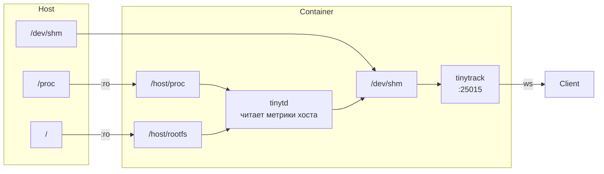

# TinyTrack в Docker

## Как это работает

TinyTrack в контейнере мониторит **хостовую** систему через bind-mount:



`tinytd` читает `/host/proc/stat`, `/host/proc/meminfo` и т.д. — данные хостовой системы.

---

## Быстрый старт

### docker compose (рекомендуется)

```bash
docker compose up -d
docker compose logs -f
docker compose down
```

### docker run

```bash
docker build -t tinytrack .

docker run -d \
  -v /proc:/host/proc:ro \
  -v /:/host/rootfs:ro   \
  -v /dev/shm:/dev/shm   \
  -p 25015:25015         \
  tinytrack
```

---

## Конфигурация

### Вариант 1: ENV переменные (простой)

```bash
docker run -d \
  -v /proc:/host/proc:ro -v /:/host/rootfs:ro -v /dev/shm:/dev/shm \
  -p 25015:25015 \
  -e TT_INTERVAL_MS=500 \
  -e TT_L1_CAPACITY=7200 \
  -e TT_LOG_LEVEL=debug \
  tinytrack
```

Полный список ENV: [CONFIGURATION.md](CONFIGURATION.md#env-переменные-docker)

### Вариант 2: Свой конфиг-файл

```bash
docker run -d \
  -v /proc:/host/proc:ro -v /:/host/rootfs:ro -v /dev/shm:/dev/shm \
  -v /path/to/my.conf:/etc/tinytrack/tinytrack.conf:ro \
  -p 25015:25015 \
  tinytrack
```

> ENV переменные патчат конфиг даже если он смонтирован — ENV всегда имеет приоритет.

### Вариант 3: docker-compose с кастомным конфигом

```yaml
services:
  tinytrack:
    image: tinytrack:latest
    volumes:
      - /proc:/host/proc:ro
      - /:/host/rootfs:ro
      - /dev/shm:/dev/shm
      - ./my-tinytrack.conf:/etc/tinytrack/tinytrack.conf:ro
      - tinytrack-data:/var/lib/tinytrack
    ports:
      - "25015:25015"

volumes:
  tinytrack-data:
```

---

## TLS

```bash
# Генерация сертификата
openssl req -x509 -newkey rsa:4096 -keyout server.key -out server.crt \
    -days 365 -nodes -subj '/CN=localhost'

docker run -d \
  -v /proc:/host/proc:ro -v /:/host/rootfs:ro -v /dev/shm:/dev/shm \
  -v $(pwd)/certs:/certs:ro \
  -p 25015:25015 \
  -e TT_LISTEN=wss://0.0.0.0:25015 \
  -e TT_TLS_CERT=/certs/server.crt \
  -e TT_TLS_KEY=/certs/server.key \
  tinytrack
```

Подключение: `wss://localhost:25015/websocket`

---

## tiny-cli внутри контейнера

```bash
# docker run
docker exec -it <container_id> tiny-cli status
docker exec -it <container_id> tiny-cli metrics
docker exec -it <container_id> tiny-cli history l1
docker exec -it <container_id> tiny-cli dashboard

# docker compose
docker compose exec tinytrack tiny-cli status
docker compose exec tinytrack tiny-cli dashboard
```

---

## Персистентность данных

Shadow-файл (история метрик) хранится в `/var/lib/tinytrack/`. Для сохранения между перезапусками:

```yaml
volumes:
  - tinytrack-data:/var/lib/tinytrack
```

---

## Ограничения

| Параметр | Поведение в Docker |
|----------|--------------------|
| `hostname` | Отражает UTS namespace контейнера, не хоста |
| `os_type` | Читается из `/host/proc/sys/kernel/ostype` — хостовое ядро ✓ |
| `uptime` | Читается из `/host/proc/uptime` — аптайм хоста ✓ |
| CPU/RAM/Net | Данные хоста через `/host/proc` ✓ |
| Disk usage | `statvfs(/host/rootfs)` — диск хоста ✓ |
